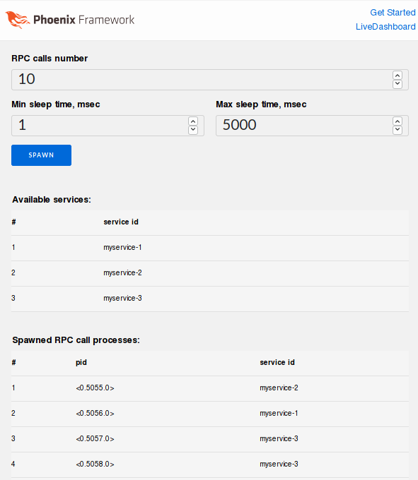

# MeshxRpc Demo - Upstream Client

## Installation
`myapp` is a slightly modified vanilla Phoenix LiveView application generated using: `mix phx.new myapp --live --no-ecto`.

After cloning repository, configure and start application:
```shell
cd myapp
mix deps.get && mix compile
# edit config/[dev, test].exs with your Consul agent settings
cd assets && npm install && node node_modules/webpack/bin/webpack.js --mode development
iex --erl "-start_epmd false" -S mix phx.server
```

## Usage
After visiting Phoenix application ([`localhost:4000`](http://localhost:4000)) from your browser, you should be able to see:


UI settings:
  * **RPC calls number** - number of RPC calls to asynchronously execute,
  * **Min/Max sleep time, msec** - defines min..max time range that RPC call will use to generate random sleep time simulating work.

## Code
Application using dynamic supervisor defined in `Myapp.Meshx.Supervisor` module starts mesh upstream client defined in `Myapp.Meshx.Worker`. Details of mesh service providers and upstream clients are described in `MeshxRpc` package [documentation](https://hexdocs.pm/meshx_rpc).

Remote mesh service provider [`service`](https://github.com/andrzej-mag/meshx_rpc_demo/tree/master/service) exposes one function: `do_work([tmin, tmax])`. Function sleeps for a random amount of time in `tmin..tmax` range simulating some work (e.g. jpg image processing/classification task) and returns `{:ok, service_id}`. `tmin` and `tmax` are defined by user with **[Min/Max sleep time]** setting.

After clicking **SPAWN** button, application spawns **[RPC calls number]** of RPC calls using `spawn/3`. Spawned processes execute `do_work` RPC call, simulating work on remote RPC service node. After receiving result, id of RPC service that answered call is inserted to **[Spawned RPC call processes]** table.

Experiments that can be executed: changing UI settings and especially starting and stopping `service` nodes to evaluate service mesh load balancing and high availability features.
